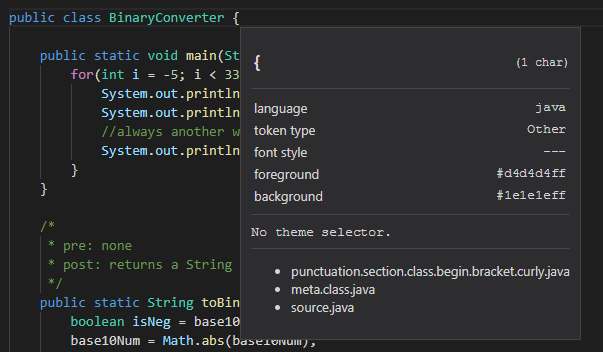

# Language Support

Bracket Pair Colorizer 2 leverages the inbuilt VSCode Text Mate parsing engine

To add language support, first the tokens must be identified.

Example of how `Java` support was added:

---

### Step 1:

`ctrl+shift+p => Developer: Inspect TM Scopes`  

  

---

### Step 2:

Find a bracket you want tokenized:

  

Currently only parsing by top level tokens is supported: e.g. `punctuation.section.class.begin.bracket.curly.java`

---

### Step 3

Identify if the token is part of a pair. (e.g. if a token has `.begin/.open`, usually there is another token with `.end/.close`)

So our token can be split into

* `punctuation.section.class` (startsWith)
* `.begin.bracket.curly` (openSuffix)
* `.java` (language identifier)

We discard the language identifier

Now we can add this information to `bracket-pair-colorizer-2.languages`

```
 "language": "java",
    "scopes": [
        {
            "startsWith": "punctuation.section.class",
            "openSuffix": ".begin.bracket.curly",
            "closeSuffix": ".end.bracket.curly"
        },
```
---

Note: Some tokens do not have open/close suffixes (e.g. `punctuation.bracket.round.java`),  
in which case only the `startsWith` property needs to be set to `punctuation.bracket.round`

---

### Step 4

Contribute your findings back to the project by creating [a new issue or pull request](https://github.com/CoenraadS/Bracket-Pair-Colorizer-2).